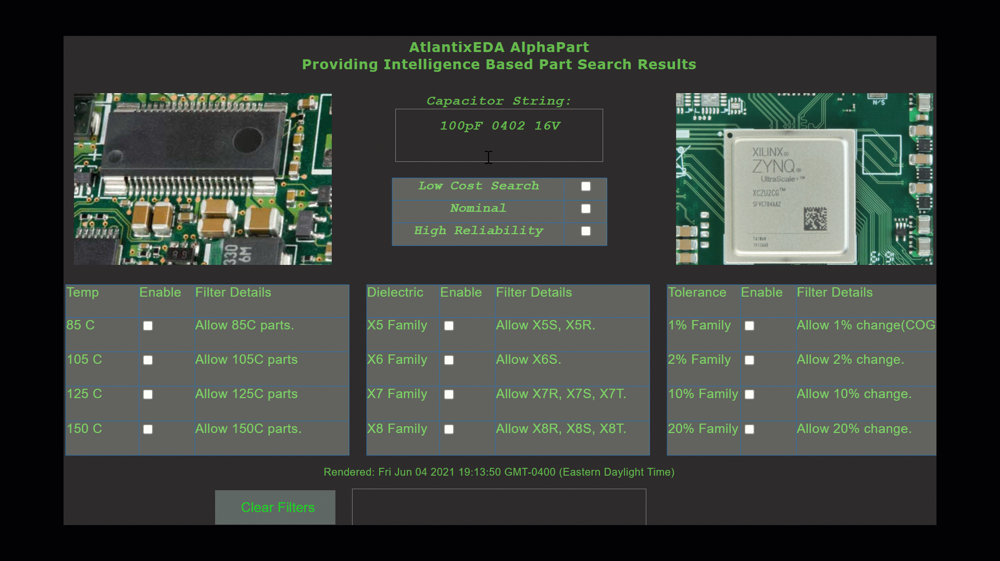

# yewPart
An electronic component *design optimization application* built with Rust, Yew, and WASM.

 **yewPart** *integrates* engineering know-how of circuit design with a software based search and filtering algorithm. 

The process of selecting components when designing circuits and printed circuit boards can be quite involved. Typically parts are designed in a circuit, and then component availability is researched. 

**yewPart** takes a different approach. The decision making is infused via *selection filters* which are applied after an part search via http requests is conducted and generic part information is retrieved. This is done by accessing various component information servers.

Currently, **yewPart** supports capacitors. There are other components such as inductors and various semiconductors in development. Capacitors offer a wide range of choices. They are often the part of the Bill of Material that hardware designers spend the most time with. **yewPart** optimizes the circuit design of capacitors by providing:

- Generic search, feating capacitance, package, and voltage such as 100 pF 0402 16V

- Relevant filters based on engineering properties of temperature, dielectric, and tolerance
  
- Capacitor result best fitting selection filters for the generic search

Currently, the program does *not* return any results. The backend code is in another repository and is built with reqwest module. 
However, the front end code as shown is a minimum viable product for the front end design of the product. In terms of a demo, 
this code exposes how to compose a Yew design with multiple inputs and a terminal like window that provides feedback. 

## How to run

The examples are built with [trunk](https://github.com/thedodd/trunk).
You can install it with the following command:

```bash
# clone the directory
git clone https://github.com/saturn77/yewPart.git

# at some point in the future, trunk will automatically download wasm-bindgen
cargo install trunk wasm-bindgen-cli
```
Running an example is as easy as running a single command:

```bash
# move into the directory that was cloned
cd yewPart

# build and serve the example
trunk serve --release
```
## Program Use
Using **yewPart** is relatively simple. First, enter a generic search string for a capacitor, which must only include capacitance, package, and minimum voltage. Then apply filters, starting with a pre-defined filters and modify that filter according to your preferences, or just select the filters that you want manually. 



## Search Filters

There are three general search filter categories.

1. *Temperature* (for example, if looking for high reliability parts, choose 125C or 150C only)

2. *Dielectric* (for example, if you want X7R or X8R components only, enable the X7 and X8 family)

3. *Tolerance* (for example, if you choose 10% tolerance, then only parts with 10% will appear)

Some predefined filters are provided. For example, "High Reliability" will search with filters of 125C, 150C, X7, X8, and 10%,20% tolerances. The "Low Cost" filter will select 85C, 105C, X5, X6, and 10% and 20% enabled.

The MSG handling of the checkboxes to select the temperature, dielectric, and percent filters for the case of LowCost is shown below. This example is shownn to illustrate the ease with one can easily adjust the filter properties.


```rust
            Msg::LowCost => {
                if !self.state.low_cost {
                  self.text = " ".to_string();
                  self.text = "Low Cost search selected.".to_string();  
                  self.state.dielectric.clear();
                  self.state.temperature.clear();
                  self.state.tolerance.clear();
                  self.state.temperature.t85  = true;
                  self.state.temperature.t105 = true; 
                  self.state.dielectric.x5    = true;
                  self.state.dielectric.x6    = true;
                  self.state.tolerance.p10    = true;
                  self.state.tolerance.p20    = true; 
                  self.state.nominal          = false;
                  self.state.high_rel         = false;
                  self.state.low_cost         = true; 
                } else {
                    self.text = " ".to_string();
                    self.text = "Low Cost search removed.".to_string();
                    self.state.low_cost        = false;  
                }
                true 
            }
```
## Rust with Yew and WASM
The Yew framework is inspired by Elm and React and overall I find that it is of reasonable complexity to work with and is rapidly maturing. Basically it is new and is suggested for internal tooling and development, and is not quite production ready. However, it seems reasonable to develop with it now seeing that it's trajectory will be one of a robust framework in the years to come. Yew has a standard type of Traits that operate on a data struct to creat the GUI - these being

- create()
- update() 
- change()
- view()
 
The update and change methods somewhat overall in functionality, but if you want to design a larger application with compponents and children using the change method will allow upstream components to access  your application. For smaller applications, using the update method is fine. 

Traditionally I have developed GUI's with Qt and Python or C++. While Qt has a long legacy and is quite powerful, the WASM environment is compelling. For example, a WASM file is easy to distribute to a large audience of users via a simple web server (or serverless approach) and thus provides wide user access. Alternatively, the WASM program can be run locally on localhost as an application. Accessing the application in the browser is appealing to users of the software.

The Yew enumerated Msg:: framework is analogous to Qt's signals where an event occurs and triggers a signal, or in the case of Yew, a Message. Yew specifies the use of enumerated types (Rust algebraic data types) to handle these messages.


