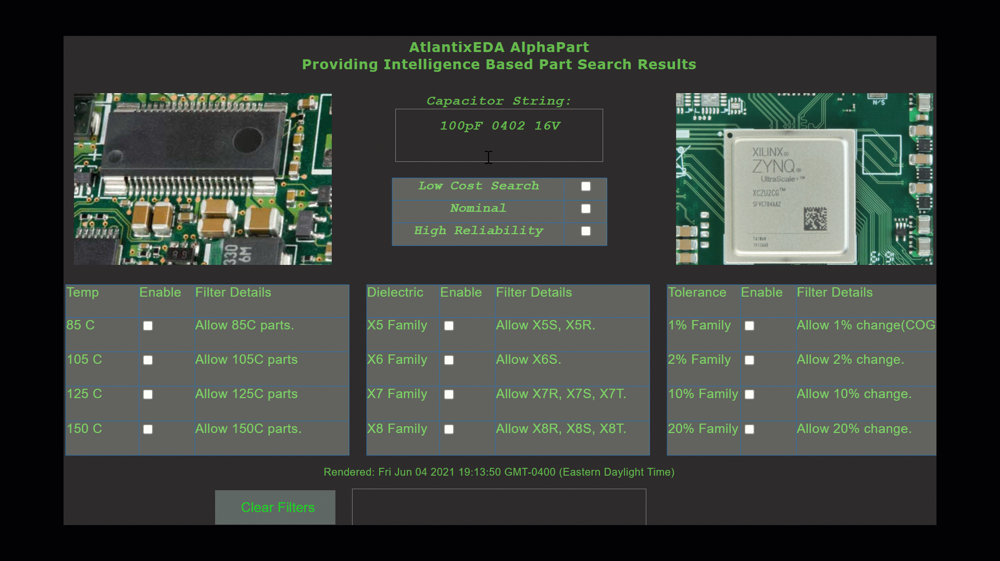

# yewPart
An intelligent search engine for electronic components and circuit design featuring Rust, Yew, and WASM. 

**yewPart** automates electrical engineering hardware design, providing intelligence to the process of Search and Design.

The process of selecting components when designing circuits and printed circuit boards can be quite involved. Typically parts are designed in a circuit, and then component availability is researched. The purpose of yewPart is to allow for intelligent searching of components as part of the design process, essentially merging the selection and design process together. 

The other way of looking at **yewPart** is that the engineering know-how of selecting a part for a design is *infused* into yewPart, allowing the engineer's decision making capability part of the algorithm. The decision making is infused via *selection filters* which are applied after an async http request for the part's information is retrieved. This is done by accessing the Octopart API via Json/GraphQL. 

Currently, **yewPart** supports capacitors, while other components such as inductors and various semiconductors are also in development. Capacitors offer a wide range of choices, and are often the part of the Bill of Material that hardware designers spend the most time with. **yewPart** addresses these issues by providing a mechanicsm for:

- Generic search, for example, 100 pF 0402 16V

- Async requests to Octopart API

- Intelligent filters for the JSON responses from the Generic search

To run the program, simply use 

## How to run

The examples are built with [trunk](https://github.com/thedodd/trunk).
You can install it with the following command:

```bash
# clone the directory
git clone https://github.com/saturn77/yewPart.git

# at some point in the future, trunk will automatically download wasm-bindgen
cargo install trunk wasm-bindgen-cli
```

Running an example is as easy as running a single command:

```bash
# move into the directory that was cloned
cd yewPart

# build and serve the example
trunk serve --release
```


## Program Use
Using **yewPart** is relatively simple. First, enter a generic search string for a capacitor, which must only include capacitance, package, and minimum voltage.

Then apply filters. Select pre-defined filters of low cost, nominal, or high reliability  as a starting point and then adjust any of the specific filters once doing this. Alternatively just select the filters that you want manually. 


For example, 1uF 0805 25V. Second, apply filters filters for the preferred search :




## Search Filters

There are three general search filter categories.

1. *Temperature* (for example, if looking for high reliability parts, choose 125C or 150C only)

2. *Dielectric* (for example, if you want X7R or X8R components only, enable the X7 and X8 family)

3. *Tolerance* (for example, if you choose 10% tolerance, then only parts with 10% will appear)


Some predefined filters are provided, for example, the check button that says "High Reliability" will search with filters of 125C, 150C, X7, X8, COG, and all tolerances enabled. The radio button that says "Low Cost" will search with filters of 85C, X5, and 10% and 20% enabled.


## Yew and WASM
Traditionally I have developed GUI's with Qt and Python or C++. While Qt has a long legacy and is quite powerful, the WASM environment is compelling. For example, a WASM file is easy to distribute to a large audience of users via a simple web server (or serverless approach) and thus provides wide user access. Alternatively, the WASM program can be run locally on localhost as an application. Accessing the application in the browser is appealing to users of the software.

The Yew framework is inspired by Elm and React and overall I find that it is of reasonable complexity to work with and is rapidly maturing. Basically it is new and is suggested for internal tooling and development, and is not quite production ready. However, it seems reasonable to develop with it now seeing that it's trajectory will be one of a robust framework in the years to come. Yew has a standard type of Traits that operate on a data struct to creat the GUI - these being

- create()
- update() 
- change()
- view()
 
The update and change methods somewhat overall in functionality, but if you want to design a larger application with compponents and children using the change method will allow upstream components to access  your application. For smaller applications, using the update method is fine. 

The Yew enumerated Msg:: framework is analogous to Qt's signals where an event occurs and triggers a signal, or in the case of Yew, a Message. Yew specifies the use of enumerated types (Rust algebraic data types) to handle these messages.


## Search Mechanism and Program Use
Using **yewPart** is relatively simple. First, enter a generic search string for a capacitor, which must only include capacitance, package, and minimum voltage. For example, 1uF 0805 25V. Second, apply filters filters for the preferred search :

1. *Choose temperature* (for example, if looking for high reliability parts, choose 125C or 150C only)

2. *Choose dielectric* (for example, if you want X7R or X8R components only, enable the X7 and X8 family)

3. *Choose tolerance* (for example, if you choose 10% tolerance, then only parts with 10% will appear)

## Pre-defined Filters

Some predefined filters are provided, for example, the check button that says "High Reliability" will search with filters of 125C, 150C, X7, X8, COG, and all tolerances enabled. The radio button that says "Low Cost" will search with filters of 85C, X5, and 10% and 20% enabled.

